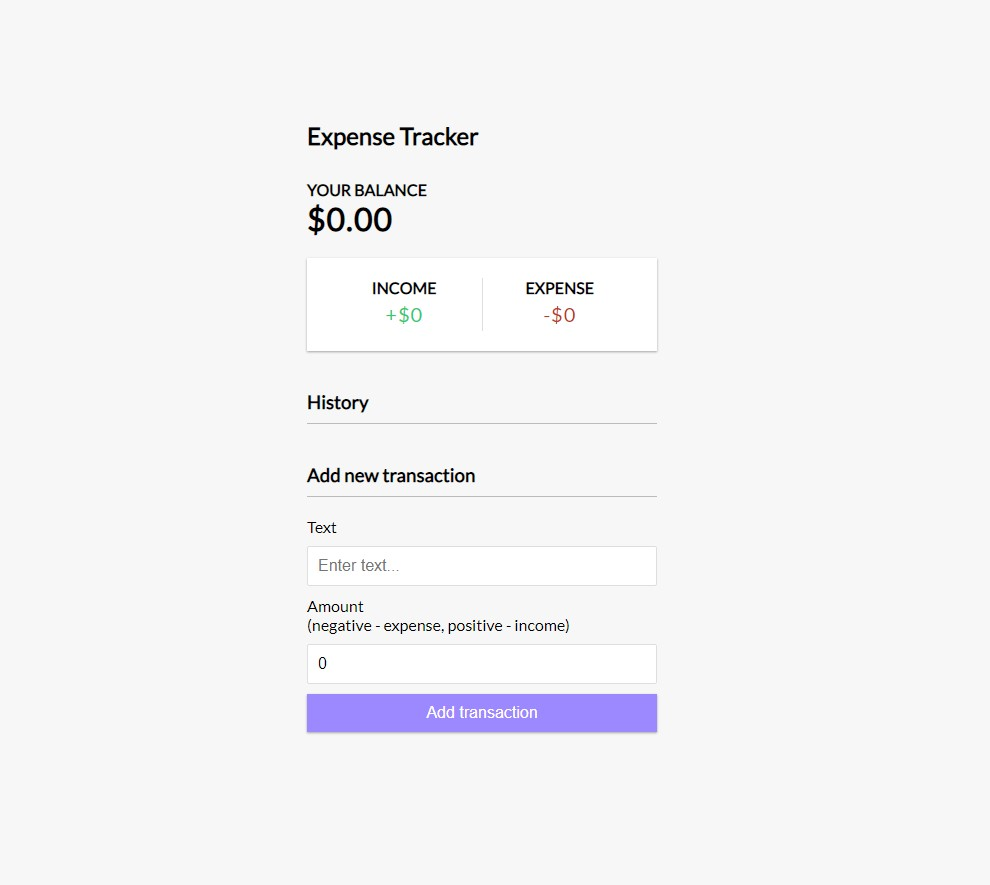
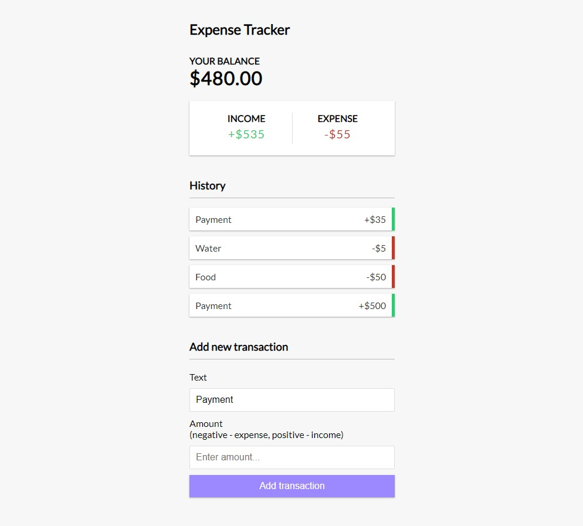

# The Expense Tracker App with Context API

This project was bootstrapped with [Create React App](https://github.com/facebook/create-react-app).

The required modules
`npm install`

Runs the app
`npm start`

Runs the app in the development mode.\
Open [http://localhost:3000](http://localhost:3000) to view it in your browser.

The page will reload when you make changes.\
You may also see any lint errors in the console.

## Project Info

You can add a new transaction.

You can delete transaction.

You can see your income and expenses.

You can see your current balance.

## Image From The Project

## Added Transaction of The Project

